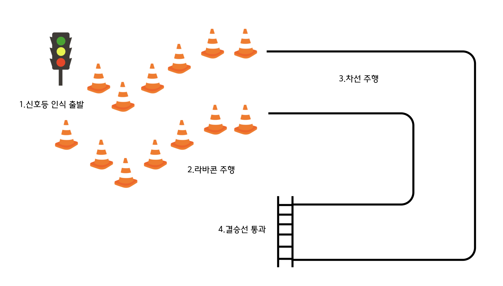

# AME 자율주행 해커톤 대회
* 일시: 2025년 7월 9일(수) - 7월 11일(금)
* 장소: 서울 강남구 영동대로 513 3층 코엑스 C 홀

## 대회 참가 인원
* 주경호 / 한동대학교
* 이수민 / 한동대학교
* 최승원 / 한동대학교

## 자율주행 프로젝트
---
* 주요 내용: 실제 코딩 기반으로 2팀이 동시에 출발하여 결승선을 먼저 통과
* 차량 조건: 자이트론 실습용 자율주행 모형차량 C모델

| 구분 | 세부내용 | 비고 |
| :------------: | :------------------------------: | :------------: |
| 프레임 | 1/12 크기 자동차 차체 프레임 (LWH 47*20*17cm) | - |
| SW | 리눅스 / ROS / 파이썬 프로그래밍 | - |
| 프로세서 모듈 | 라즈베리파이 4B 4G / RAM 4GB / SD카드 64GB | - |
| 센서 | IMU 관성센서, 카메라, 초음파센서, 무선랜 등 | - |

* 예선 트랙

## OS & Tool & Device

* OS
>* Linux: 1991년 개발된 Lunux kernel 기반 오픈소스 운영체제이다.
* Tool
>* ROS: 로봇 개발을 위해 tools, libraries 등을 제공하는 오픈소스 플랫폼이다.
>* Arduino: MCU 기반으로 만들어진 보드 및 오픈 소스 개발 환경(IDE)이다.
>* Ubuntu: Debian 기반의 오픈 소스 Linux 운영체제의 한 종류이다.
>* Python: 쉬운 문법,인터프리터, 객체지향, 다양한 라이브러리, 등의 특징으로 가장 맣이 사용되는 프로그래밍 언어 중 하나이다.
>* PyTorch: 파이썬 기반 오픈소스 딥러닝 프레임 워크로 컴퓨터 비전, 자연어 처리 등 다양한 인공지능 분야에서 활용되고 있다.
* Device
>* Raspberry:  리눅스 커널 기반의 개발이 가능한 보드로 임베디드, IoT 분야에서 사용된다.
>* IMU Sensor: 물체의 움직임, 기울기, 회전, 방향 등을 실시간으로 측정하여 파악하는 센서이다.
>* Ultrasound Sensor: 초음파를 이용하여 물체와의 거리를 측정하는 센서이다.
---
## 프로젝트 

서론
* 동기 및 문제 정의(ex. 자율주행 시스템의 동향 및 문제인식)
* 목표 및 해결 방안(ex. 안정적인 자율 주행 시스템을 구현)

본론
* 시스템 구조 및 목표 사항 
>1. 신호등 인식 출발
>2. 라바콘 주행
>3. 차선 주행
>4. 결승선 통과
* OS & Tool & Device
>* OS: Linux, ROS
>* Tool: Ubuntu,Arduino,Python
>* Device: Raspberry 4B,IMU Sensor,IMU Sensor,Ultrasound Sensor
* 시스템 설계안 및 구현 방법
* 적용 시나리오

결론
* 중요사항 및 요약
* 기대 효과 및 활용 가능성

---

