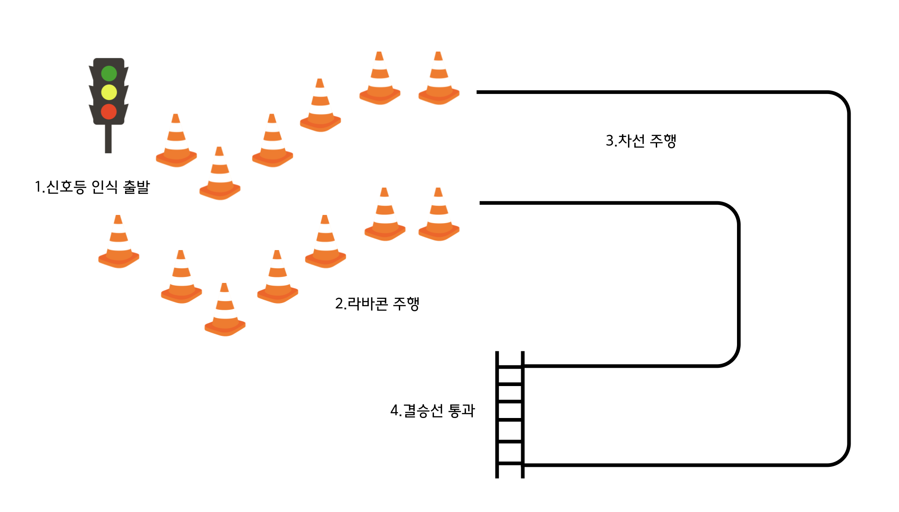

# AME 자율주행 해커톤 대회
* 2025년 자율주행 해커톤 대회 신청 자료

## 대회 참가 인원
* 주경호 / 한동대학교
* 이수민 / 한동대학교
* 최승원 / 한동대학교

## 자율주행 프로젝트
---
* 주요 내용: 실제 코딩 기반으로 2팀이 동시에 출발하여 결승선을 먼저 통과
* 차량 조건: 자이트론 실습용 자율주행 모형차량 C모델

| 구분 | 세부내용 | 비고 |
| :------------: | :------------------------------: | :------------: |
| 프레임 | 1/12 크기 자동차 차체 프레임 (LWH 47*20*17cm) | - |
| SW | 리눅스 / ROS / 파이썬 프로그래밍 | - |
| 프로세서 모듈 | 라즈베리파이 4B 4G / RAM 4GB / SD카드 64GB | - |
| 센서 | IMU 관성센서, 카메라, 초음파센서, 무선랜 등 | - |

* 예선 트랙:

## OS & Tool & Device
---
* OS
>* Linux: 
>* ROS: 
* Tool
>* Arduino: 
>* Ubuntu:
>* Python: 
* Device:
>* Raspberry 4B: 
>* IMU Sensor: 
>* USB Camera: 
>* Ultrasound Sensor: 
---
## 프로젝트 

서론
* 동기 및 문제 정의(ex. 자율주행 시스템의 동향 및 문제인식)
* 목표 및 해결 방안(ex. 안정적인 자율 주행 시스템을 구현)

본론
* 시스템 구조 및 목표 사항: 
>1. 신호등 인식 출발
>2. 라바콘 주행
>3. 차선 주행
>4. 결승선 통과
* OS & Tool & Device
>* OS: Linux, ROS
>* Tool: Ubuntu,Arduino,Python
>* Device: Raspberry 4B,IMU Sensor,IMU Sensor,Ultrasound Sensor
* 시스템 설계안 및 구현 방법: 
* 적용 시나리오: 

결론
* 설계안 중요사항 및 요약
* 기대 효과 및 활용 가능성

---

